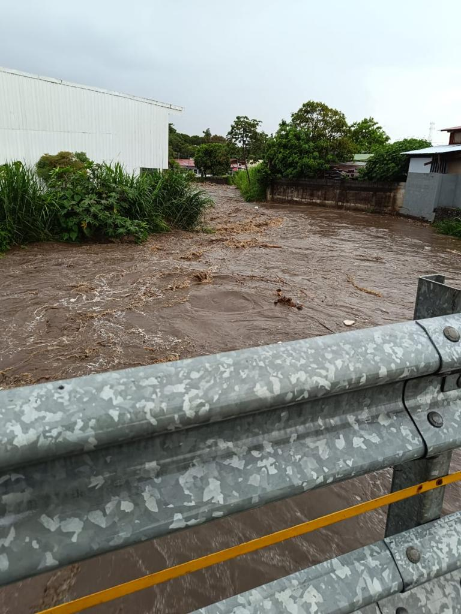
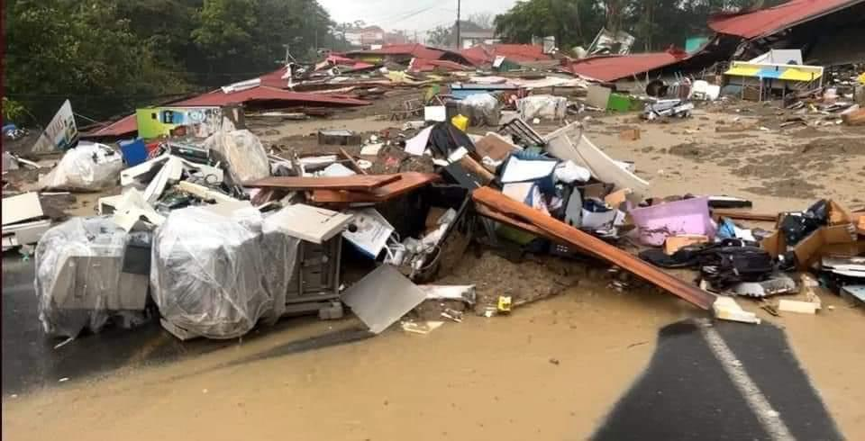

 

  <h1>Resumen General del Proyecto de Graduacion</h1>

 

   <h2> "Elaboración de una herramienta de software para la identificación de zonas de riesgo a inundaciones mediante el aporte de datos recopilados por voluntarios e instituciones públicas" </h2> 

 
 

####  *Programacion en aplicaciones SIG. Tarea 1* *Elaborado por Samanta Solano H.*

## **Introducción**

Una de las problemáticas que tienen los costarricenses en la época de invierno, son los
desbordamientos de ríos generados por diferentes situaciones, desde acumulación de
sedimentos, incluyendo contaminación, o hasta un proceso natural de caída de árboles, o
desprendimientos de laderas, entre otras situaciones. Lo anterior se ha tratado de solventar con diferentes talleres de cómo actuar ante una situación de riesgo, o incluso, con la recolección de información después de una inundación, sin embargo, tinene su nivel de dificultad obener una manera de anticiparnos ante una emergencia de este tipo.  
Se propone la generación de una aplicación en ArcGIS Online, donde por medio
de un enlace público, ciertos grupos específicos de la población costarricense, sean capaz de recolectar información ya sea antes o durante estos sucesos, y se pueda generar una base de datos, del cual, las institución de emergencias como la   <a href="https://www.cne.go.cr/">Comision Nacional de Prevencion de Riesgo y Atencion de Emergencias (CNE)</a> o los Comites de Emergencias de la Municipalidades como el 
<a href="https://www.belen.go.cr/web/guest/comite-municipal-de-emergencia"> Comite de Emergencias de la Municipalidad de Belen</a>, puedan tener un monitoreo de cuales zonas son más vulnerables y cuales ocupan de un auxilio de diferente índole, o bien que instituciones del gobierno sepan dónde se podría correr un riesgo y sean capaces de tomar una decisión antes de que ocurra una catástrofe.

 

 

Puente en Belén, fuente desconocida, 2023

## **Metodología**

Este proyecto se dividirá en 4 fases importantes: investigación, la aplicación, las
capacitaciones de divulgación y el análisis de los datos de la información recopilada, con el
fin de establecer parámetros de mejora en todo el proyecto. La idea principal de estas fases
es buscar siempre el bien común de la población, estimando diferentes escenarios de lo que
puede ocurrir y beneficiar al usuario.

### 1. Investigación.  

A partir de las preguntas de investigación, se vio necesario la búsqueda de información
inicial, sobre instituciones que atienden situaciones de riesgo del tipo natural o bien del
antropológico, y para este caso la CNE es la que se escogió como institución principal, ya
que entre sus objetivos es generar planes de riesgos que beneficies a la población en
situaciones de riesgo, para eso se coordinó una reunión con el área de TI, con el fin de
obtener información actualizada de la recolección y manejo de datos de riesgo ante
inundaciones.

### 2. Aplicación

Se realizra por medio de ArcGis Online, una herrameta, que por medio de una encuesta sea capaz de obtener informacion y desplegar los resultados en fuerma de mapas. De manera general, algunas de las preguntas que se realizaran son como las siguientes:

1. Ubicacion 
    - Provincia, canton, distrito y comunidad
2. Tipo de incidente 
    - Se añadiria diferentes posisbles situaciones que se esten dando en el momento
3. Si trabajo en el area publica, privada u otro
4. Edad
5. Entre otras variables.

### 3. Capacitaciones

Se trabajara con los grupos de estudio con el fin de que entiendan la importancia de este proyecto y como puede afectarnos de manera positiva la recoleccion de esta informacion.

### 4. Análisis

Una vez recolectado los datos se procede a analizar las posibles zonas vulnerables que
puedan llegar a afectar a la zona de estudio, y para ello es necesario, haber investigado ya
sea por medio de la municipalidad de la zona de estudio o instituciones que lleven un
registro sobre las zonas vulnerables y generar una comparación con el fin de demostrar la
funcionalidad de la aplicación, y así mismo demostrar por medio de mapas de calor las
diferencia que se lleguen a encontrar.

## **Posible Conclusión**

Se espera que las diferentes instituciones del pais ya sea nacionales o privadas puedan participar en la recoleccion de informacion, y que pueda utilizarse como insumo en las tomas de desiciones para mejorar la calidad de vida de las personas.

 

  <h5></h5>

 

 

  <h5>Inundación en Agua Zarcas. Jara,A. 2023</h5>

 

